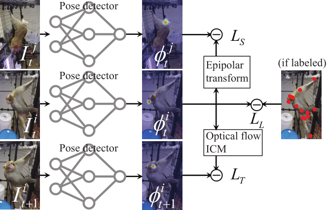
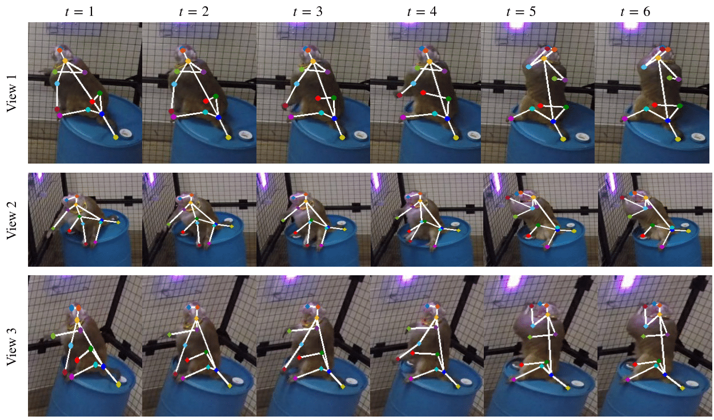
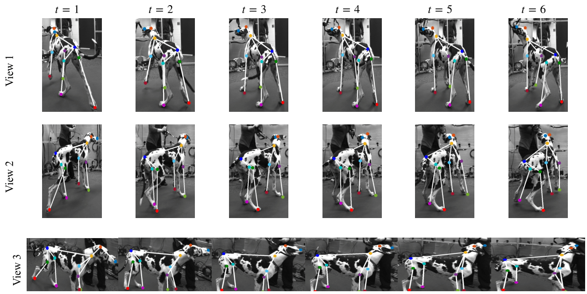
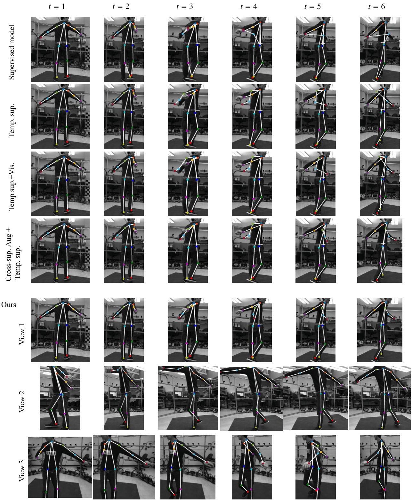

## Abstract

This paper presents a semi-supervised learning framework to train a keypoint detector using multiview image streams given the limited labeled data (typically $<$4\%). We leverage the complementary relationship between multiview geometry and visual tracking to provide three types of supervisionary signals to utilize the unlabeled data: (1) keypoint detection in one view can be supervised by the other view via the epipolar geometry; (2) a keypoint moves smoothly over time where its optical flow can be used to temporally supervise consecutive image frames to each other; (3) visible keypoint in one view is likely to be visible in the adjacent view. We integrate these three signals in a differentiable fashion to design a new end-to-end neural network composed of three pathways. This design allows us to extensively use the unlabeled data to train the keypoint detector. We show that our approach outperforms existing detectors including DeepLabCut tailored to the keypoint detection of non-human species such as monkeys, dogs, and mice.

## Framework of MSBR

## More Evaluation 
<video src="vids/msbr.mp4" width="640" height="400" controls preload></video>

### Non-human (Customed keypoints)

### Human joints

